# a07g-exploring-the-CLI

* Team Number: 07
* Team Name: Studying Team
* Team Members: Guanlin Li & Xinmi Wang
* GitHub Repository URL: https://github.com/ese5160/final-project-a07g-a14g-t07-studying-team
* Description of test hardware: SamW25 Dev Board

## 1 Software Architecture
### Hardware Requirements Specification (HRS)
   1. Overview

      The project consists of a motor, a magnetic encoder, a battery, a LCD screen, a MCU, several pushbuttons and LEDs. This project aims to build a multi-purpose controller base on a spinable knob that utilizes the motor and the magnetic encoder to provide real-time force feedback to the user. This includes emulating a multi-phase mechanical knob or delivering resistance when the knob is turned beyond defined limits. Moreover, the LEDs should give the user light feedback based on the movements they do, and also shows real-time data on the LCD screen to provide feedback to the user. The user should be able to use this knob to control different kinds of devices that could utilize the Wi-Fi module to communicate. 

   2. Abbreviations

      * FOC: Field Oriented Control
      * BLDC: Brushless DC Motor
      * LCD: Liquid Crystal Display

   3. Functionality

      * HER01: The LCD screen shall respond to user inputs from the knob and pushbuttons by displaying appropriate user interface elements. 
      * HRS02: The knob shall provide dynamic force feedback using the brushless motor. Force feedback shall be adjustable based on system state and shall include modes such as:
         * Discrete detents (e.g., a virtual 5-position switch)
         * Boundary limits with increased resistance
         * Smooth, continuous motion with minimal resistance
      * HRS03: When operating solely on battery power (with external DC input disconnected), the device shall function continuously for at least 2 hours under normal usage, including motor actuation, LCD activity, and periodic LED and button interaction.
      * HRS04: The LEDs shall react to user's input on the knob and the pushbutton by providing visual cues, such as:
        * indicating current mode
        * signaling out of range knob rotation
        * display battery status
        * highlight selected choice by user
      * HRS05: The magnetic encoder shall detect the angular position of the knob with a resolution of at least 5 degrees and update this measurement at a minimum rate of 50 Hz. The encoder’s data shall be used in real-time to control motor feedback and UI updates. 
      * The system shall be capable of switching between different knob behavior modes through a combination of knob rotations and pushbutton inputs. Mode changes shall be reflected immediately on the LCD and in the feedback behavior.
      * The system shall start up and reach a ready-to-use state within 10 seconds of power being applied, indicating readiness via the LCD screen.

### Software Requirements Specification (SRS)

   1. Overview

      This project develops a software system for a customizable motorized knob interface, intended for use in applications such as smart home control and PC peripherals. The software will interpret user input from a magnetic rotary encoder and pushbutton, handle communication over Wi-Fi module, and manage real-time feedback via the motor, LCD screen and RGB LEDs. The system's key point is to implement the force feedback knob that should provide proper feedback to the user via the knob that is powered by the motor in different modes, such as virtual knob mode, out of range mode, free spin mode and more. The system should also implement behavior logic and provide seamless interactions with external smart devices. 

   2. Abbreviations

      MQTT: Message Queuing Telemetry Transport
      UI: User Interface
      PWM: Pulse Width Modulation
      API: Application Programming Interface

   3. Functionality

      * SRS 01: The system shall detect and process knob rotation and pushbutton input events using the magnetic encoder and debounce logic. Encoder readings shall be interrupt-driven with an effective update rate of at least 50 Hz (i.e., every 20 ms). 
      * SRS 02: The software shall manage force feedback behavior by calculating appropriate torque profiles and sending control signals to the motor controller using PWM in real-time. Force modes shall include:
         * Discrete detents (configurable number)
         * Stops at configurable angles
         * Free spin with optional resistance
      * SRS 03: The system shall control RGB LEDs to provide visual feedback corresponding to system states or active modes. Each mode shall be assigned a color defined in a configuration table. LED updates shall occur within 200 ms of a mode change.
      * SRS 04: The software shall support MQTT communication over Wi-Fi, allowing it to:
         * Subscribe to topics for remote control of knob behavior (e.g., force mode, LED color).
         * Publish events such as knob rotation angle, button presses, and current mode.
         * Reconnect automatically within 5 seconds after a connection drop.
      * SRS 05: The LCD display shall render a dynamic user interface that reflects real-time system state. Updates to UI elements (e.g., text, icons, menus) must be completed within 200 ms of a user action.

Q2

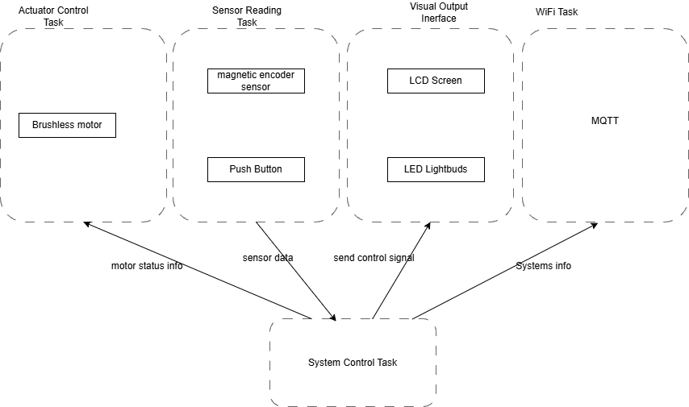

  

Q3.
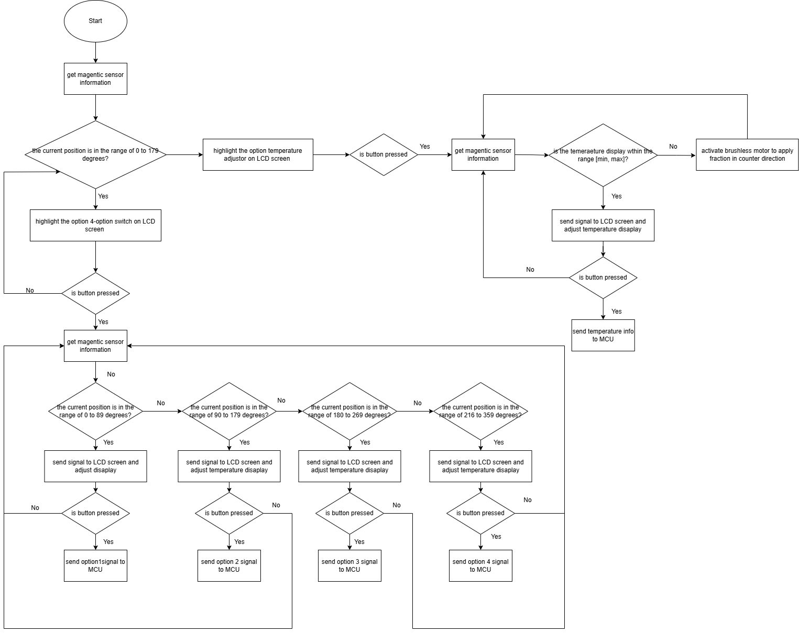

## 2 Understanding the Starter Code

Q1. The `InitializeSerialConsole()` provides the initialization function of the Serial Port, which initialize the UART hardware, registers, interrupts, and callback functions for USART events. The `cbufRx` defines the buffer size of the receive buffer, and the `cbufTx` defines the buffer size of the transmit buffer. These two buffers are of type circular buffer structures named cbuf_handle_t in SerialConsole.c, which was further defined in the circular_buffer.h as circular_buf_t. 
 
 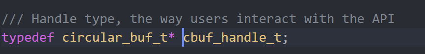

 The structure of circular_buf_ is further defined in circular_buffer.c. 

 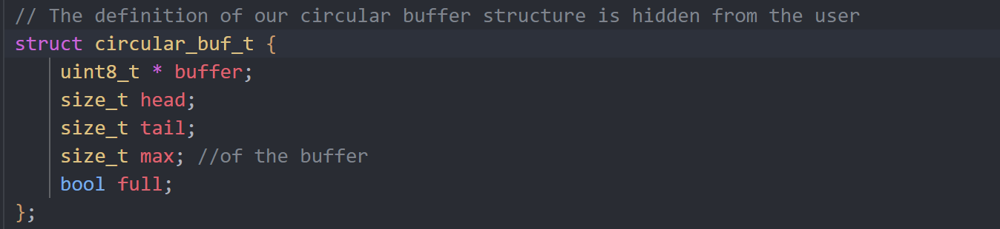

Q2. 
   
   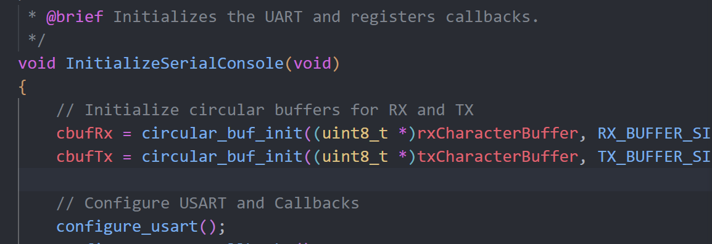

   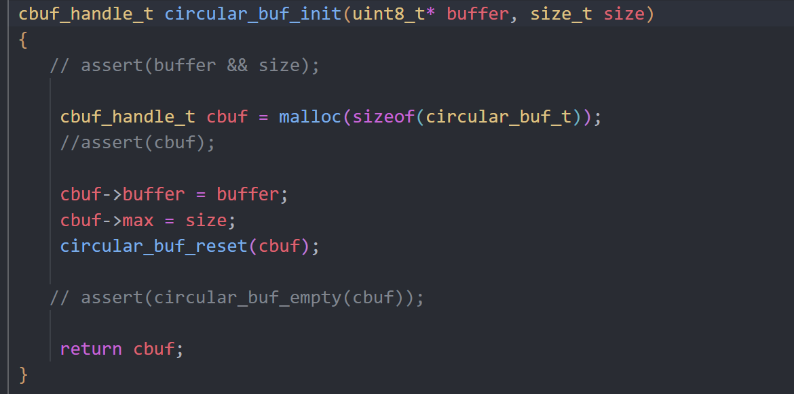

   `cbufRX` and `cbufTx` are initialized by the function `circular_buf_init()` inside InitializeSerialConsole in SerialConsole.c, which is further defined in circular_buffer.c specifies the address to the buffer and the size of the buffer. The library is circular_buffer.c. 

Q3. 
   
   

   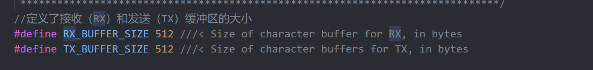
   
   The Rx and Tx characters are being stored at `rxCharacterBuffer` and `txCharacterBuffer`, where each one has the size of `RX_BUFFER_SIZE` and `TX_BUFFER_SIZE` which is 512 bytes. 
   
Q4. 
  
   
   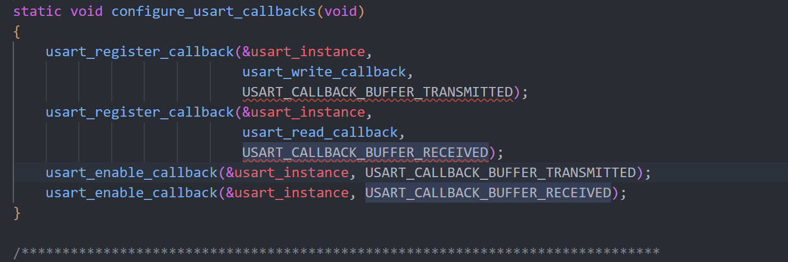

   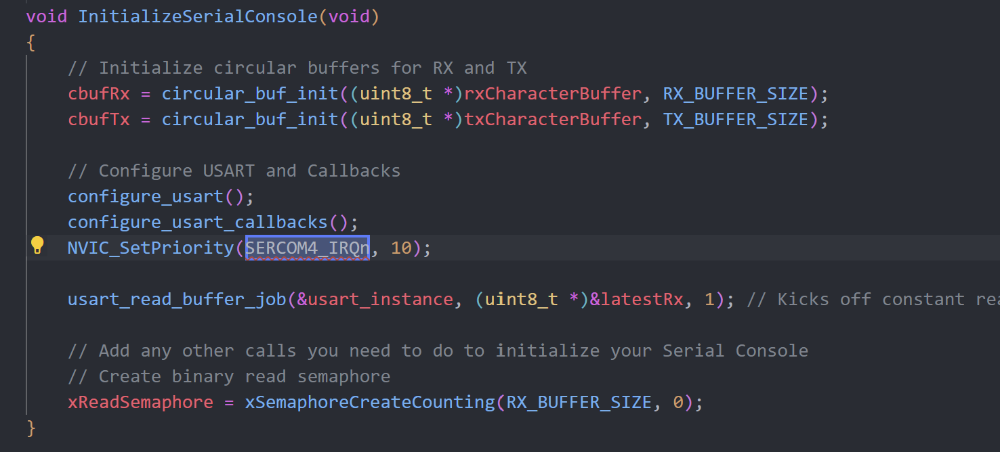
   The USART character sending interrupt process utilizes the usart_write_callback function, triggered by the SERCOM4_IRQn interrupt vector when a byte finishes transmitting, to fetch and send the next byte from the TX buffer via usart_write_buffer_job, enabling non-blocking, interrupt-driven communication managed by the ASF library.

   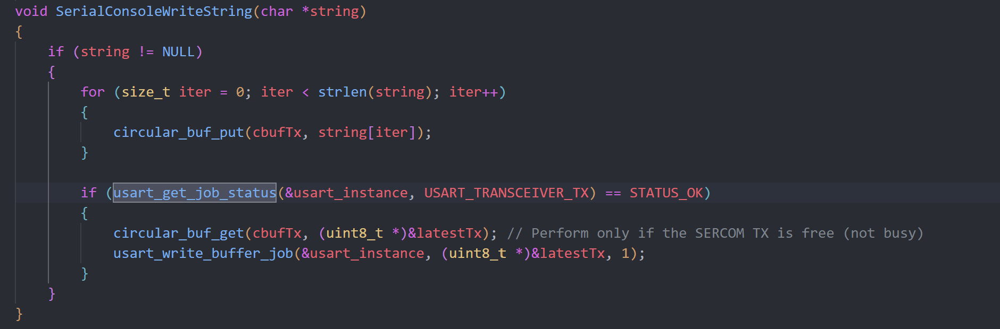
   
   The UART sent interrupt is called in usart_get_job_status inside SerialConsoleWriteString in SerialConsole.c when checking the current status of the usart. If ready(the SERCOM TX is free), proceeding to send data. If not ready, interrupt will be introduced until ready.

   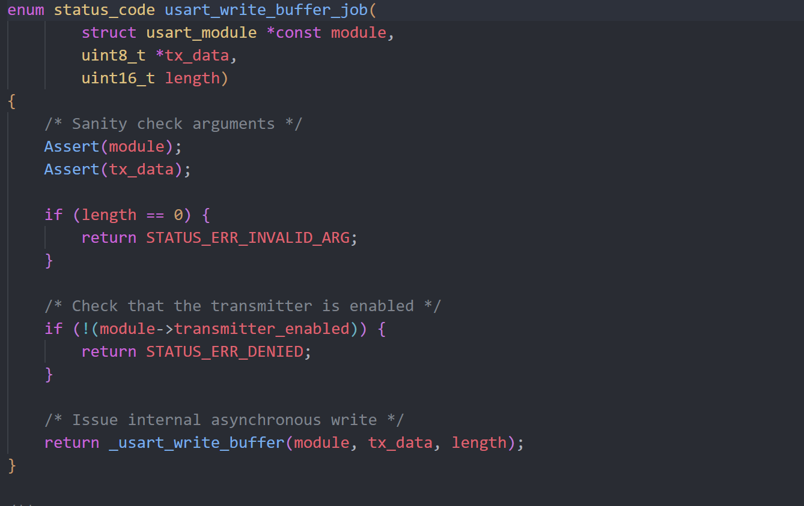

   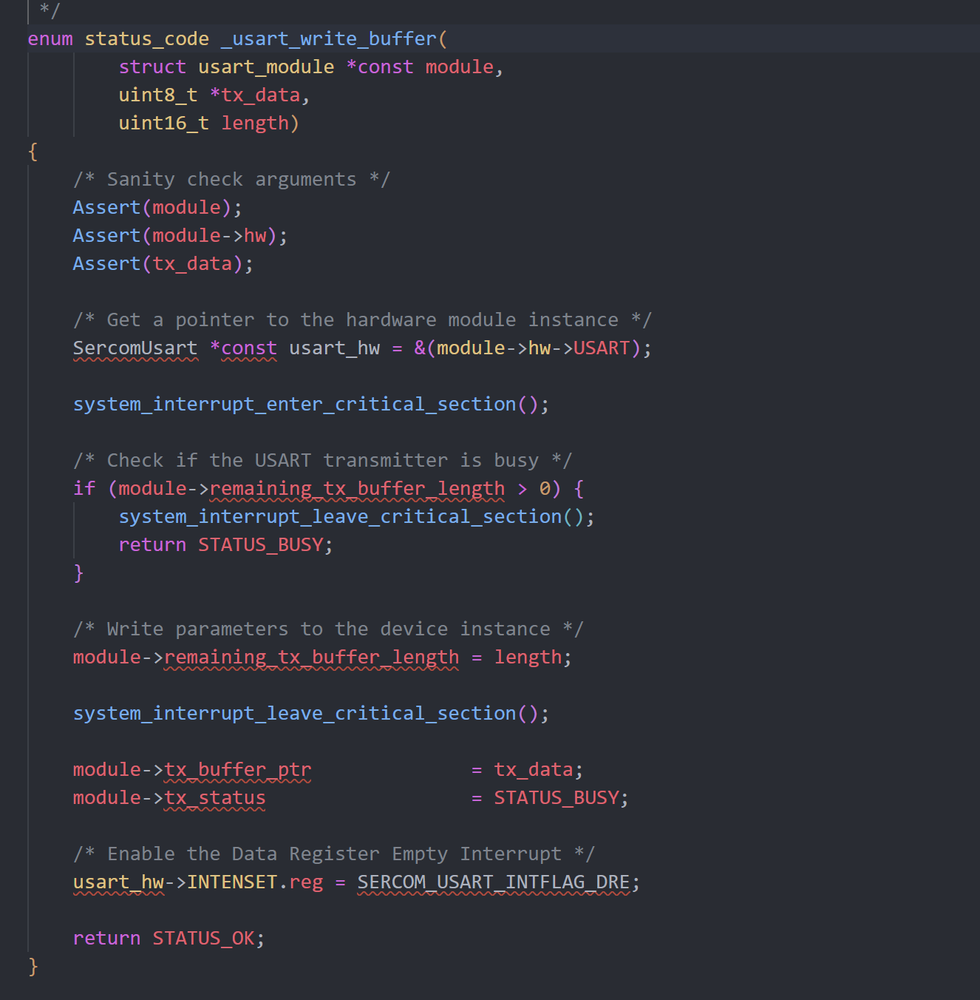

   To further explain, the usart_write_job fuction is defined in usart_interrupt.c. Inside usart_wirite_job（）, the usart_write_buffer perform the send data task.  Inside the usart_write_buffer, usart_hw->INTENSET.reg = SERCOM_USART_INTFLAG_DRE is called to enable the Data Register Empty (DRE) interrupt.  It sets up the USART hardware to trigger an interrupt when it is ready to accept more data.

   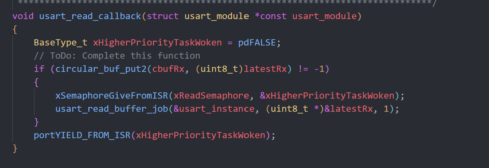

   
  The ASF library handles low-level interrupts internally, utilizing the usart_read_callback as user-defined logic triggered by the SERCOM4_IRQn interrupt, with key functions like usart_read_buffer_job and usart_register_callback managing UART data reception. 

  The UART received interrupt is called in usart_read_callback() in SerialConsole.c when data arrives. If the data recieved in latestRx is successfully added to circular buffer cbufRx,  a semaphore is released via xSemaphoreGiveFromISR to notify the system that the data is ready for processing. Function usart_read_buffer_job will continue the data handling stopped by xSemaphoreGiveFromISR. The port_Yield_From_ISR will stop the data transmission ans switch task when higher proity task is detected. 
  

Q5. 
   
   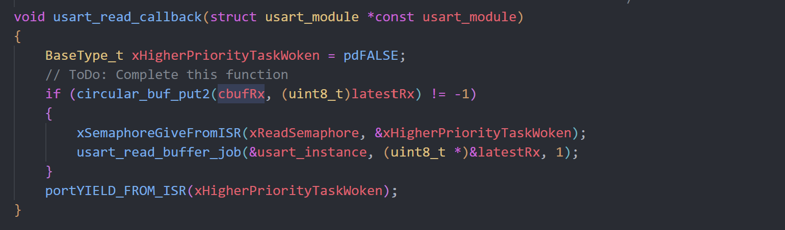
    a. The function `usart_read_callback` is called when a character is received.  

   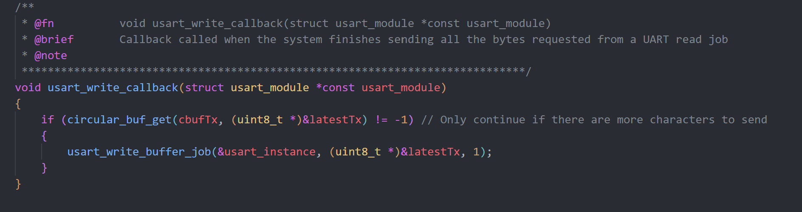
    b. The function `usart_write_callback` is called when a character has been sent. 

Q6.

 The read callback attempts to put the received data that stores in `latestRx` to the buffer `cbufRx` using function `circular_buf_put2`. If `cbufRx` is not full, the insertion success, and it restarts the read job to get the next character. The write callback checks if any data could be retrieved from `cbufTx` using function `circular_buf_get`, and if success, then put the retrieved data into `latestTx` and restart the write job. 
   
Q7.
   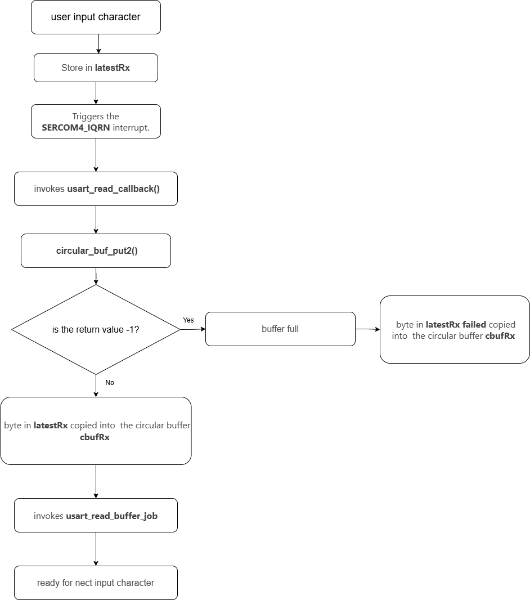

   1. User types a character.
   2. The character is transmitted through USART and get into the register `latestRx`. 
   3. An interrupt is called, triggering the callback function `usart_read_callback()`. 
   4. The callback function checks if the buffer `cbufRx` is full or not. 
   5. If `cbufRx` is not full, the data stored in the register `latestRx` are put into `cbufRx`, and restart the read job. 
   
Q8.
   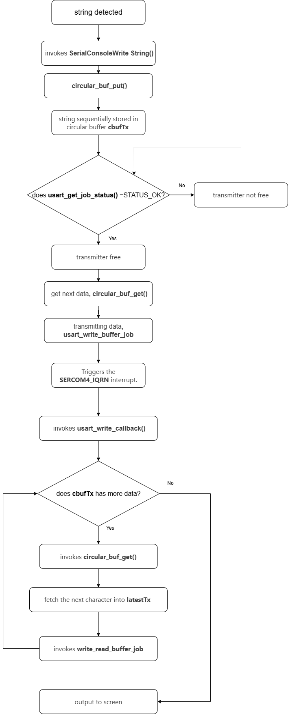

   1. A string is added to the buffer `cbufTx`.
   2. An interrupt is called, triggering the callback function `usart_write_callback()`. 
   3. The callback function checks if any data could be read from `cbufTx`. 
   4. If there are data in `cbufTx`, put the data in the register `latestTx`, and then restart the write job for potential future characters. 
   5. The data in `latestTx` is transmitted through USART. 
   
Q9. 

 It starts the thread named "CLI_TASK", and checks how many heap is free before and after the creation of this thread. Only 1 new thread is started. 

## 3 Debug Logger Module

## 4 Wiretap the convo

1. Should be attached to SERCOM4. 
2. Should attach to PB10 and PB11. 
3. We need to set the analyzer to Async Serial with a baud rate of 115200 and follow the requirements (8N1). 

Hardware connection:

Screenshot: 
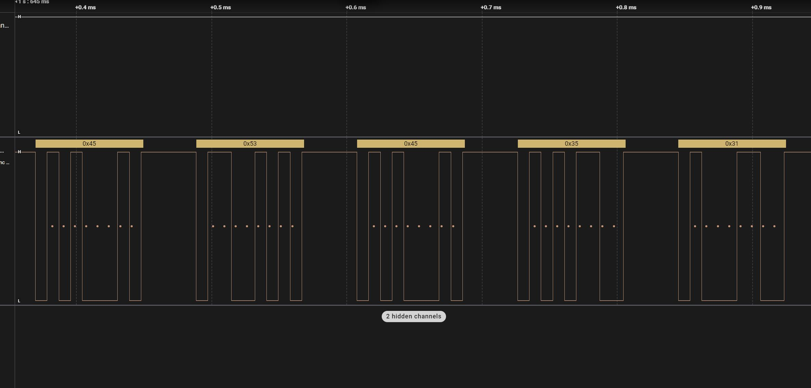

File: Located at ./A07G_files/P4_capture.sal

## 5 Complete the CLI

Please check the source code. 

## 6 Add CLI commands

<video controls src="videos/A07G/P6.mp4" title="Title"></video>

Video is located at ./videos/A07G/P6.mp4. 

Or you can click [THIS LINK](https://drive.google.com/file/d/1P5SFXJVd2SSnBR0WX3q4TfmQKcDXnWay/view?usp=sharing). 