# a07g-exploring-the-CLI

* Team Number: 07
* Team Name: Studying Team
* Team Members: Guanlin Li & Xinmi Wang
* GitHub Repository URL: https://github.com/ese5160/final-project-a07g-a14g-t07-studying-team
* Description of test hardware: SamW25 Dev Board

## 1 Software Architecture

## 2 Understanding the Starter Code

1. The `InitializeSerialConsole()` provides the initialization function of the Serial Port, which initialize the UART hardware, registers, interrupts, and callback functions for USART events. The `cbufRx` defines the buffer size of the receive buffer, and the `cbufTx` defines the buffer size of the transmit buffer. These two buffers are of type circular buffer structures named cbuf_handle_t in SerialConsole.c, which was further defined in the circular_buffer.h as circular_buf_t. 
 
 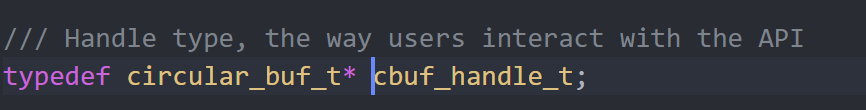

 The structure of circular_buf_ is further defined in circular_buffer.c. 

 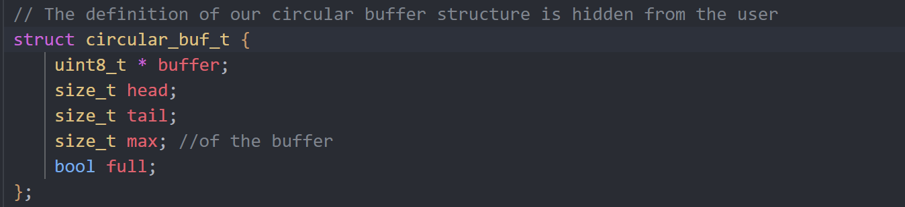

2. 
   
   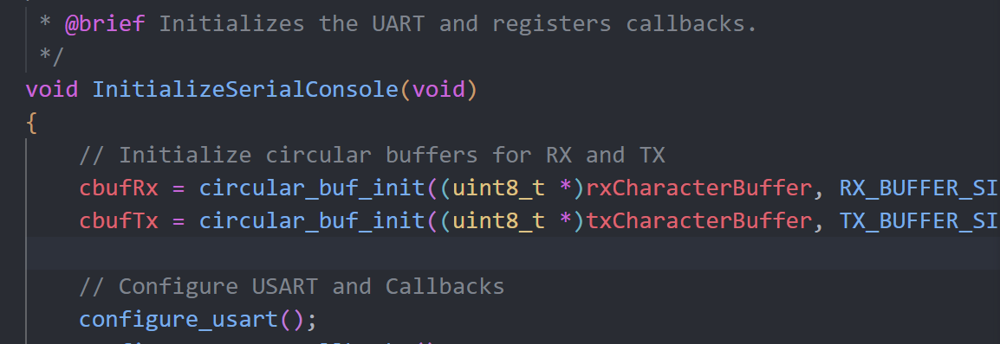

   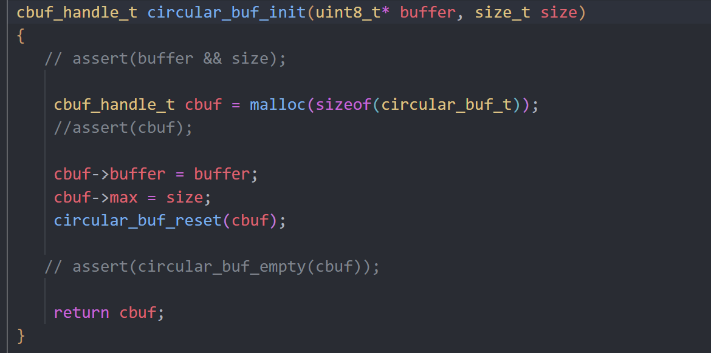

   `cbufRX` and `cbufTx` are initialized by the function `circular_buf_init()` inside InitializeSerialConsole in SerialConsole.c, which is further defined in circular_buffer.c specifies the address to the buffer and the size of the buffer. The library is circular_buffer.c. 

3. 
   
   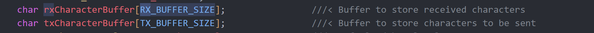
   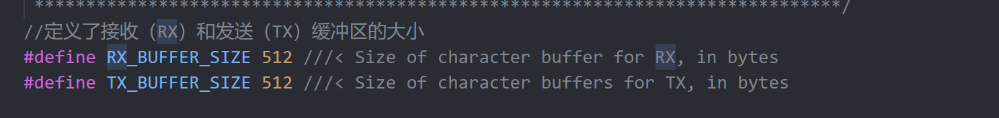
   
   The Rx and Tx characters are being stored at `rxCharacterBuffer` and `txCharacterBuffer`, where each one has the size of `RX_BUFFER_SIZE` and `TX_BUFFER_SIZE` which is 512 bytes. 
   
4. 
  
   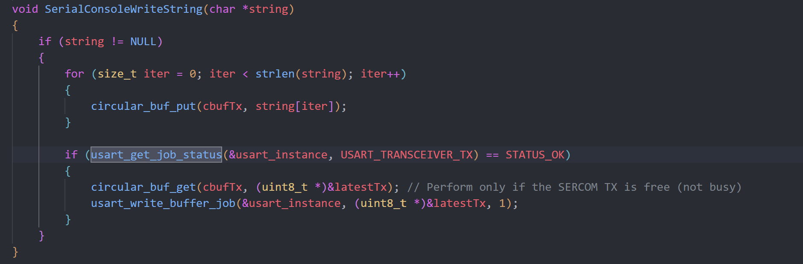

   The UART sent interrupt is called in usart_get_job_status inside SerialConsoleWriteString in SerialConsole.c when checking the current status of the usart. If ready(the SERCOM TX is free), proceeding to send data. If not ready, interrupt will be introduced until ready.

   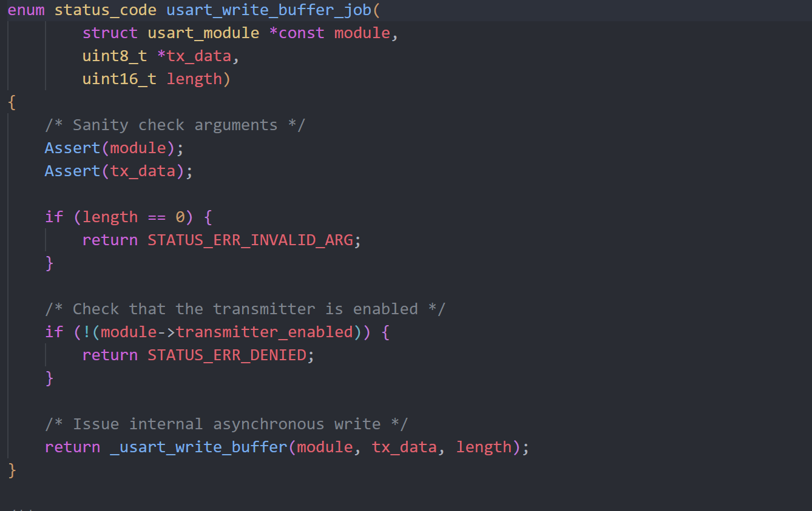
   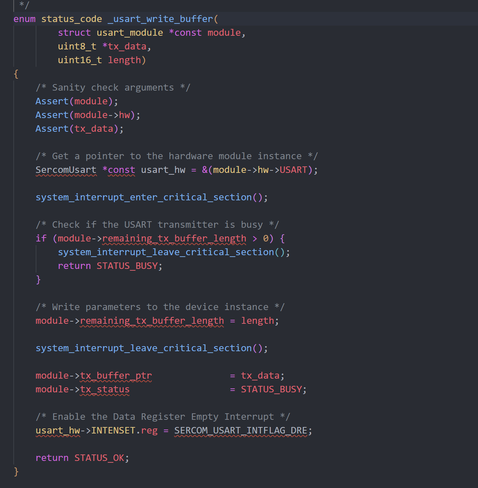

   To further explain, the usart_write_job fuction is defined in usart_interrupt.c. Inside usart_wirite_job（）, the usart_write_buffer perform the send data task.  Inside the usart_write_buffer, usart_hw->INTENSET.reg = SERCOM_USART_INTFLAG_DRE is called to enable the Data Register Empty (DRE) interrupt.  It sets up the USART hardware to trigger an interrupt when it is ready to accept more data.

   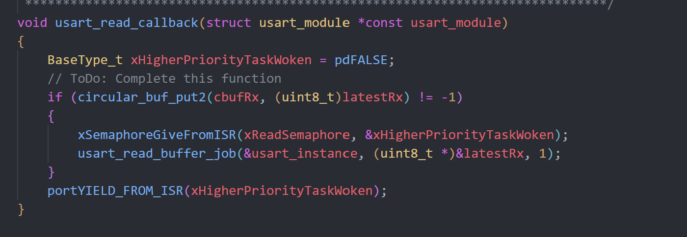
  The UART received interrupt is called in usart_read_callback inside SerialConsoleWriteString in SerialConsole.c when checking the current status of the usart. If ready(the SERCOM TX is free), proceeding to send data. If not ready, interrupt will be introduced until ready.

   

 

   The interrupts are defined inside the ASF folder. 
5. 
   
   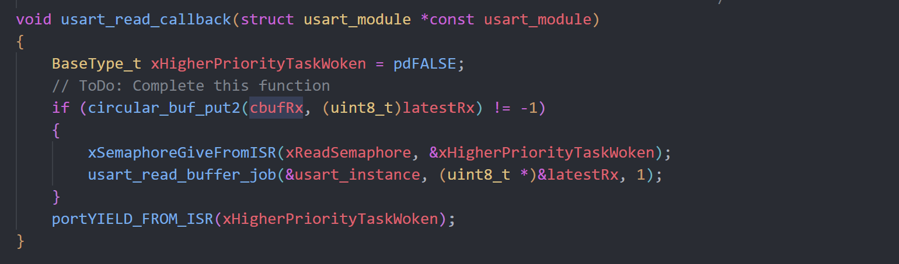
    a. The function `usart_read_callback` is called when a character is received.  

    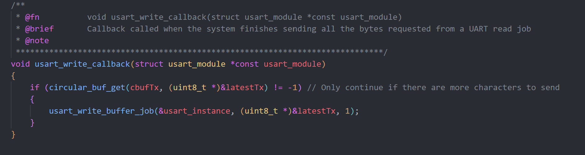
    b. The function `usart_write_callback` is called when a character has been sent. 
6. The read callback attempts to put the received data that stores in `latestRx` to the buffer `cbufRx` using function `circular_buf_put2`. If `cbufRx` is not full, the insertion success, and it restarts the read job to get the next character. The write callback checks if any data could be retrieved from `cbufTx` using function `circular_buf_get`, and if success, then put the retrieved data into `latestTx` and restart the write job. 
7. 1. User types a character. TODO
   2. The character is transmitted through USART and get into the register `latestRx`. 
   3. An interrupt is called, triggering the callback function `usart_read_callback()`. 
   4. The callback function checks if the buffer `cbufRx` is full or not. 
   5. If `cbufRx` is not full, the data stored in the register `latestRx` are put into `cbufRx`, and restart the read job. 
8. 1. A string is added to the buffer `cbufTx`. TODO
   2. An interrupt is called, triggering the callback function `usart_write_callback()`. 
   3. The callback function checks if any data could be read from `cbufTx`. 
   4. If there are data in `cbufTx`, put the data in the register `latestTx`, and then restart the write job for potential future characters. 
   5. The data in `latestTx` is transmitted through USART. 
9.  It starts the thread named "CLI_TASK", and checks how many heap is free before and after the creation of this thread. Only 1 new thread is started. 

## 3 Debug Logger Module

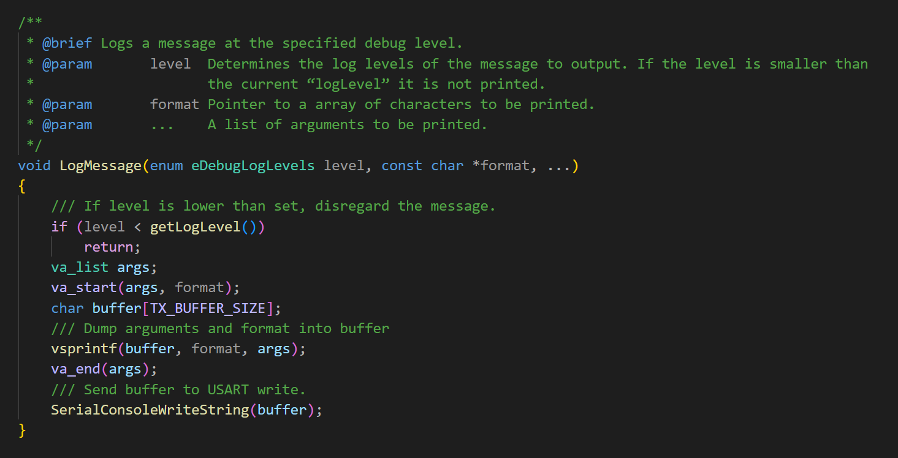

## 4 Wiretap the convo

1. Should be attached to SERCOM4. 
2. Should attach to PB10 and PB11. 
3. We need to set the analyzer to Async Serial with a baud rate of 115200 and follow the requirements (8N1). 

Hardware connection:

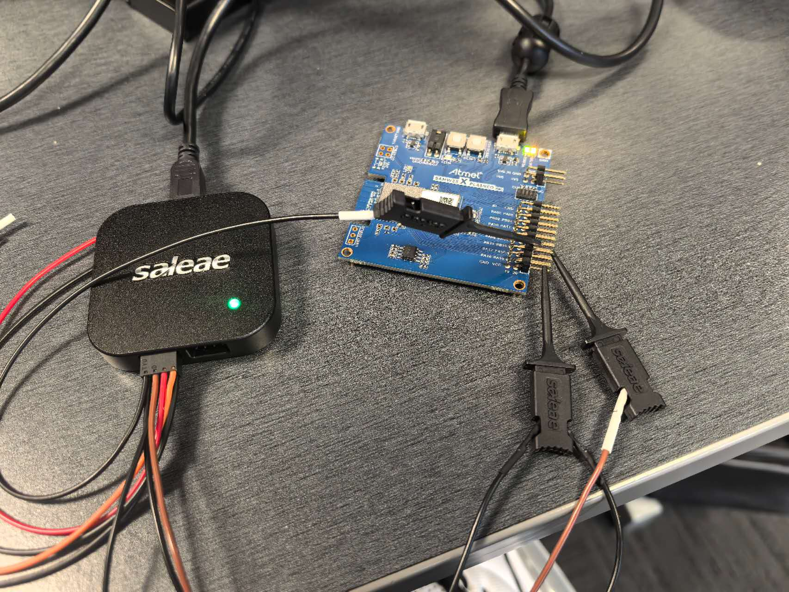

Screenshot: 

File: Located at ./A07G_files/P4_capture.sal

## 5 Complete the CLI

Please check the source code. 

## 6 Add CLI commands

<video controls src="../videos/A07G/P6.mp4" title="Title"></video>

Or you can click [THIS LINK](https://drive.google.com/file/d/1P5SFXJVd2SSnBR0WX3q4TfmQKcDXnWay/view?usp=sharing). 